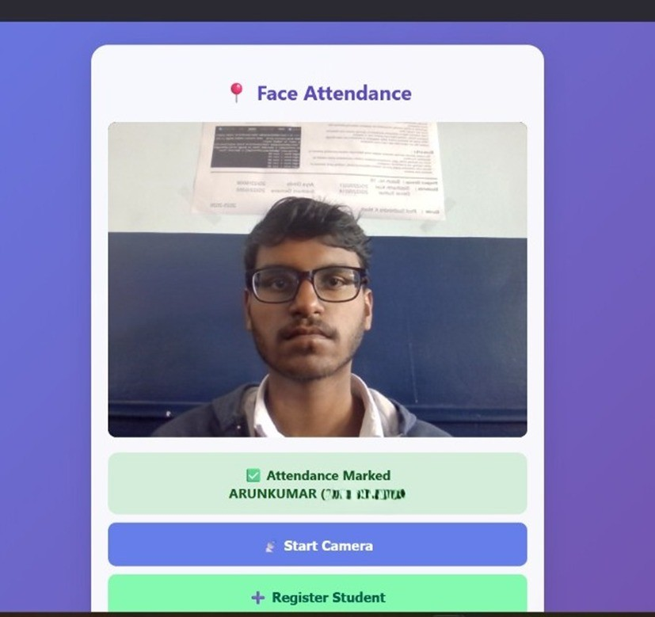
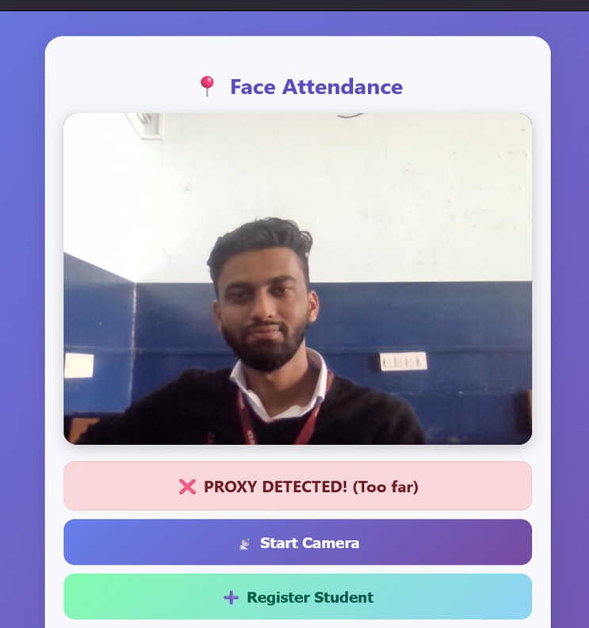
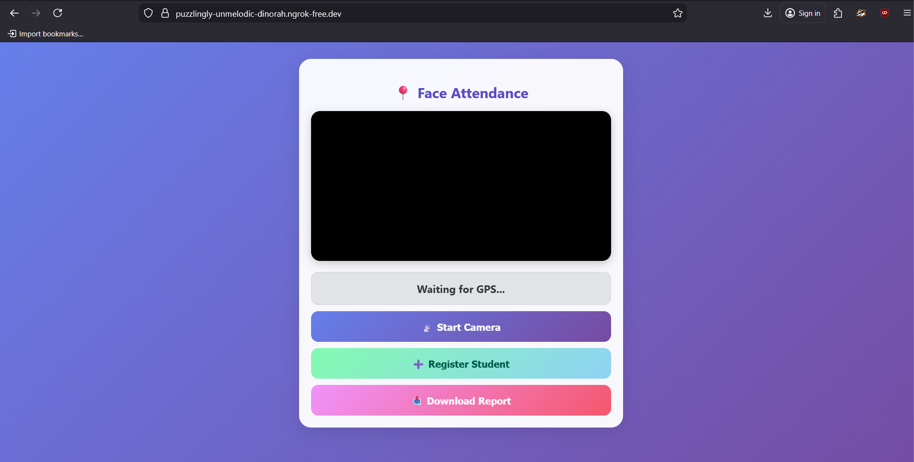

# GEO-FACE-anti-spoofing
## Problem Statement
Face spoofing attacks like print, replay, and mask attacks...

## Approach
- CNN / MobileNet / Geo-based features
- Single / Multi-modal detection

## Dataset
- CASIA-FASD / Replay-Attack / Custom
- Link only (do NOT upload dataset)

## Model
- Architecture diagram
- Loss function
- Evaluation metrics

## Results
Accuracy, FAR, FRR (with screenshots)

## How to Run
pip install -r requirements.txt
python train.py
python predict.py

## Future Work
- Multi-modal spoof detection
- Lightweight deployment

## Project Screenshots

### 1. Attendance Marked Successfully

### 2. Spoofing Attack Detected

### 3. Web Interface

